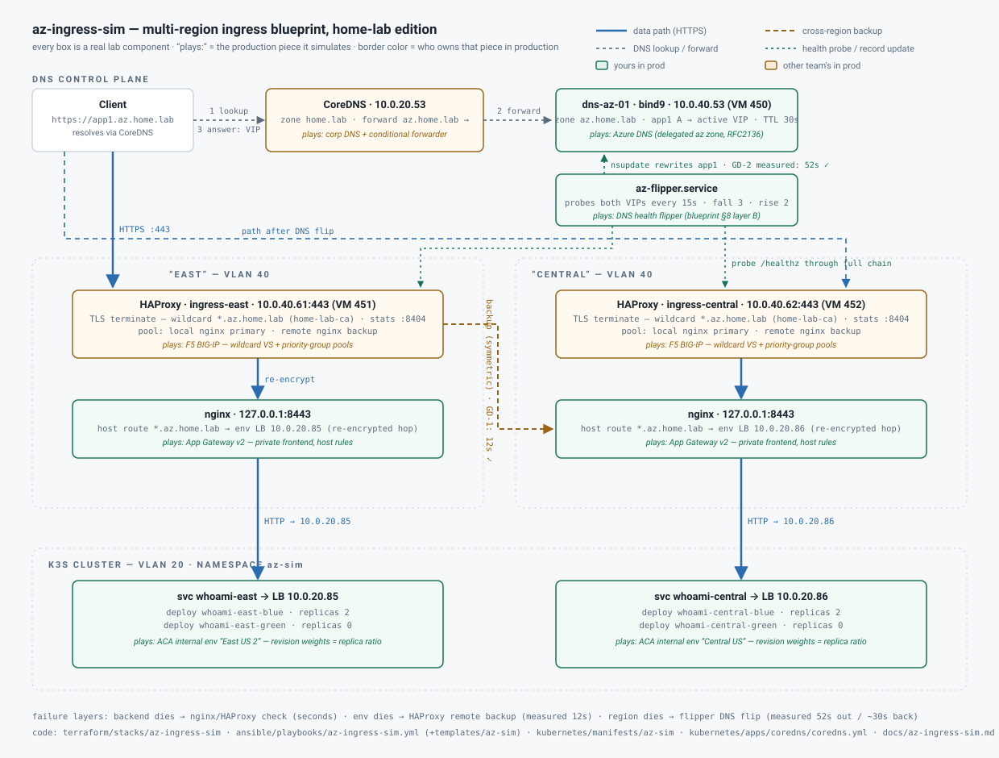

# az-ingress-sim — Ingress Blueprint Lab Validation

Home-lab test bed for the **az.comp.app ingress blueprint** (full design:
[`ai-gov-review/az-ingress-blueprint.md`](https://github.com/csGIT34/ai-gov-review/blob/main/az-ingress-blueprint.md)).
Validates the control-plane behavior — split-horizon DNS, layer contract, F5 priority-group
failover, DNS health-flipper timing, blue/green weighting — with open-source stand-ins.



## Quick validation (copy-paste, ~30 seconds)

```bash
cd ~/github/homelab

# 1. DNS: CoreDNS forwards az.home.lab to bind9, which answers with the active VIP
dig +short @10.0.20.53 app1.az.home.lab            # expect: 10.0.40.61 (east)

# 2. Full chain: TLS(HAProxy) -> nginx -> k3s env, cert verified against the lab CA
curl -s --cacert home-lab-root-ca.crt \
  --resolve app1.az.home.lab:443:10.0.40.61 \
  https://app1.az.home.lab/ | grep ^Name           # expect: Name: east-blue

# 3. Both regions independently reachable via their plumbing names
curl -s --cacert home-lab-root-ca.crt --resolve central.az.home.lab:443:10.0.40.62 \
  https://central.az.home.lab/ | grep ^Name        # expect: Name: central-blue

# 4. Flipper is watching (should show its startup line / any FLIP events)
ssh ubuntu@10.0.40.53 "sudo journalctl -u az-flipper -n 5 --no-pager -o cat"
```

Result log:

- **GD-1** (2026-08-19): east env killed → HAProxy served `central-blue` through the east
  VIP in **12s**, DNS untouched; failback after restore also 12s. (First attempt exposed
  ArgoCD `selfHeal` reverting the kill — now off for this app.)
- **GD-2** (2026-08-19): `qm stop 451` (whole east region) → flipper flipped
  `app1.az.home.lab` to central in **52s** (predicted 45–90s ✓); traffic served
  `central-blue` immediately after. VM restart → automatic failback in **~30s** after
  boot. Flipper log confirmed the state machine:
  `FLIP: 10.0.40.61 -> 10.0.40.62 (east fails=3)` and
  `FLIP: 10.0.40.62 -> 10.0.40.61 (east ok=2)`.

## Component mapping

| Blueprint (production) | Lab stand-in | Where |
|---|---|---|
| Corp DNS + conditional forwarder | CoreDNS `forward az.home.lab → 10.0.40.53` block | `kubernetes/apps/coredns/coredns.yml` |
| Azure DNS zone `az.comp.app` + Private Resolver | bind9, zone `az.home.lab`, RFC2136/TSIG | VM `dns-az-01` (10.0.40.53) |
| DNS health flipper (§8 layer B) | `az-flipper` systemd service (probe 15s, fall 3, rise 2, TTL 30) | VM `dns-az-01` |
| F5 BIG-IP: wildcard VS, TLS terminate, priority-group backup (§6.1, §8 layer A) | HAProxy: `*.az.home.lab` cert, local nginx primary + remote nginx `backup` | VMs `ingress-east` (10.0.40.61), `ingress-central` (10.0.40.62) |
| Palo Alto inline inspect | not simulated (optional later: Suricata between HAProxy and nginx) | — |
| App Gateway v2 host routing | nginx :8443, re-encrypted hop, proxies to regional env | same ingress VMs |
| ACA internal env per region | `whoami` blue/green Deployments + LoadBalancer Service | k3s ns `az-sim`, east LB 10.0.20.85, central LB 10.0.20.86 |
| Internal PKI wildcard `*.az.comp.app` | cert-manager `home-lab-ca` Certificate `az-wildcard` (ns `az-sim`) | extracted to VMs by Ansible ("Key Vault → F5 PFX handoff") |
| Canonical vs plumbing names | `app1.az.home.lab` (floating) vs `east/central.az.home.lab` (per-region) | bind zone |

Known fidelity gaps: no PA hop; HAProxy and nginx share a VM (prod: separate appliances);
one k3s cluster plays both regions; flipper is a single instance on the DNS VM (prod: both regions).
None of these affect the timing/behavior claims under test.

## Deploy (in order)

```bash
# 1. VMs (dns-az-01 450, ingress-east 451, ingress-central 452 on VLAN 40 / pve-r720)
cd terraform/stacks/az-ingress-sim
export TF_VAR_proxmox_api_token='<token>'
terraform init && terraform apply

# 2. k8s side — commit/push; ArgoCD auto-discovers the az-sim app and CoreDNS forwarder.
#    Wait for: cert issued + LBs assigned
kubectl get certificate az-wildcard -n az-sim          # READY True
kubectl get svc -n az-sim                              # 10.0.20.85 / 10.0.20.86

# 3. Configure VMs (extracts cert, sets up bind/flipper/haproxy/nginx)
cd ansible
ansible-playbook -i inventory/homelab.yml playbooks/az-ingress-sim.yml
```

Ordering matters: the playbook's first play fails fast if the cert Secret doesn't exist yet.

## Verify the steady state

```bash
dig @10.0.20.53 app1.az.home.lab          # → 10.0.40.61 (east), via conditional forwarder
curl --cacert home-lab-root-ca.crt https://app1.az.home.lab/   # Name: east-blue
curl --cacert home-lab-root-ca.crt https://east.az.home.lab/    # always east
curl --cacert home-lab-root-ca.crt https://central.az.home.lab/ # always central
# HAProxy dashboards: http://10.0.40.61:8404 and http://10.0.40.62:8404
```

(Client DNS must resolve via CoreDNS 10.0.20.53 for `az.home.lab` to work, or use
`dig`/`--resolve` explicitly.)

## Game days (the actual theory tests)

Watch during all tests: `journalctl -fu az-flipper` on dns-az-01, plus both HAProxy stats pages.

### GD-1 — Backend death → AGW/F5 layer heals (expect: seconds)
```bash
kubectl scale deploy whoami-east-blue -n az-sim --replicas=0
watch -n1 'curl -s --cacert home-lab-root-ca.crt https://east.az.home.lab/ | grep Name'
```
nginx east starts 502ing → HAProxy east health check fails (5s interval, fall 3 ≈ 15s)
→ `agw-remote` backup engages → responses say `central-blue` **while DNS still points east**.
That's blueprint §8 layer A. Restore: scale back to 2 → `rise 2` ≈ 10s to fail back.

### GD-2 — Whole region death → DNS flipper (expect: ~1–2 min)
```bash
# on pve-r720, or via Proxmox UI: stop the ingress-east VM
qm stop 451
# from a client, time the cutover:
while true; do printf '%s ' "$(date +%T)"; \
  dig +short @10.0.20.53 app1.az.home.lab; sleep 5; done
```
Flipper probes fail (15s × fall 3 ≈ 45s) → nsupdate flips record to 10.0.40.62 →
clients follow within TTL (30s). Total ≈ 45–90s. **Record this number — it's the
blueprint's headline claim.** Restart the VM: failback after rise 2 ≈ 30s.

### GD-3 — Blue/green in-region (ACA revision weights sim)
```bash
# canary green in east (ratio = replica ratio)
kubectl scale deploy whoami-east-green -n az-sim --replicas=1   # blue 2 : green 1 ≈ 67/33
for i in $(seq 20); do curl -s --cacert home-lab-root-ca.crt \
  https://east.az.home.lab/ | grep Name; done | sort | uniq -c
# promote
kubectl scale deploy whoami-east-green -n az-sim --replicas=2
kubectl scale deploy whoami-east-blue  -n az-sim --replicas=0
```

### GD-4 — Cross-region blue/green (binary DNS cutover)
```bash
# manual region cutover — same mechanism the flipper uses
ssh ubuntu@10.0.40.53 "sudo nsupdate -k /etc/bind/keys/flipper.key <<'EOF'
server 127.0.0.1
update delete app1.az.home.lab A
update add app1.az.home.lab 30 A 10.0.40.62
send
EOF"
```
Note: the flipper will fail this back to east (primary-healthy wins) — stop it first
(`systemctl stop az-flipper`) to hold a manual cutover. This mirrors the prod
flap-protection/manual-confirm design question from §8.

### GD-5 — Cert-per-listener (SNI) proof
Both `app1.az.home.lab` and `east.az.home.lab` serve the same wildcard cert; add a
per-hostname cert to HAProxy's crt dir later to prove SNI selection (blueprint §10 model).

## Timing model being validated

| Layer | Failure | Expected recovery |
|---|---|---|
| Platform (replicas) | pod death | readiness probe, seconds |
| AGW/F5 sim (HAProxy check) | env/backend down | ~15s fall, backup pool engages |
| DNS flipper | region VIP down | ~45s detection + ≤30s TTL drain |

## Teardown

```bash
cd terraform/stacks/az-ingress-sim && terraform destroy
git rm -r kubernetes/apps/az-sim kubernetes/manifests/az-sim   # ArgoCD prunes
# revert the CoreDNS forwarder block in kubernetes/apps/coredns/coredns.yml
```
